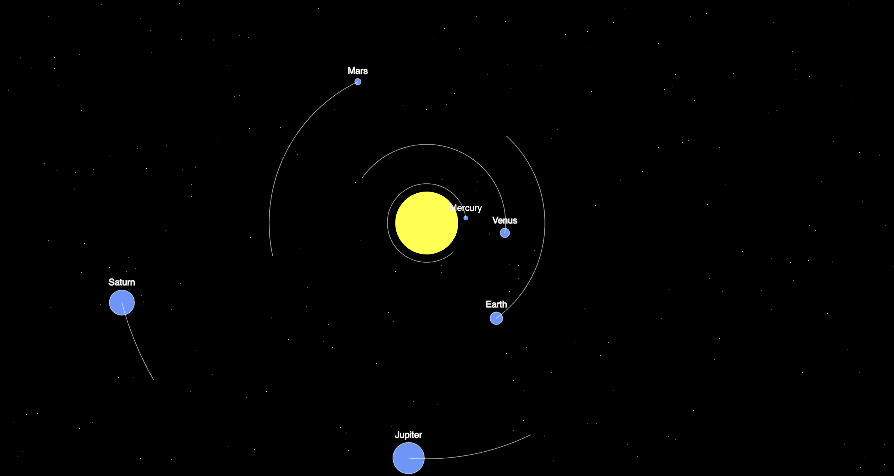
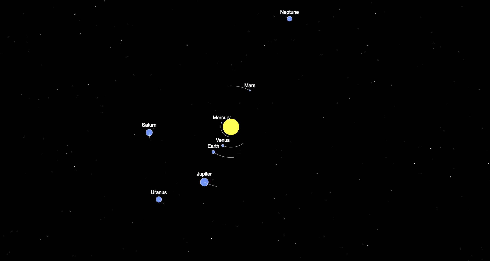

# Cosmic Explorer

## Description

Cosmic Explorer is an interactive and expandable solar system visualization project created using p5.js and JavaScript. It allows users to explore the celestial bodies of our solar system with dynamic scaling and orbital tracks. The project provides an immersive experience with a visually stunning representation of planets, stars, and elliptical orbits.

## Screenshots

